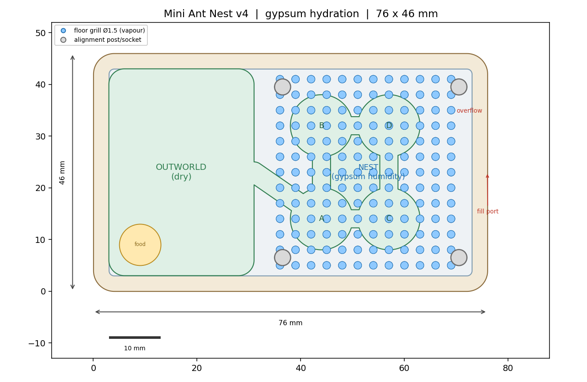
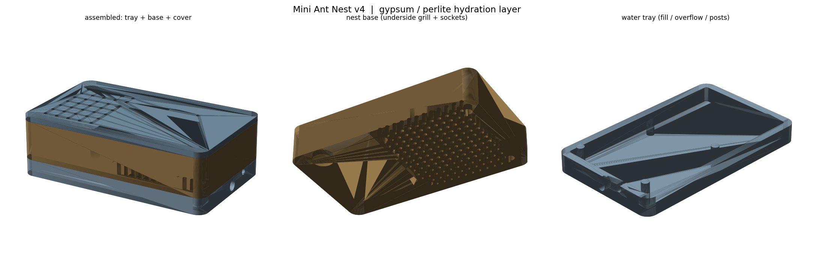

# 迷你 3D 打印蚁巢 v4 · 石膏蓄水保湿版

一套超小的模块化 3D 打印蚁巢：**76 × 46 mm**，三个零件叠放，
含**活动区、4 个巢室、连接通道、对外接管口**，以及**石膏/珍珠岩蓄水保湿层**。
全部竖直挖孔，**免支撑**，普通 FDM 打印机可直接打印。





## 三个零件

| 文件 | 说明 |
|------|------|
| `design/nest_base.stl` | **巢体**：上部为活动区 + 4 巢室 + 通道 + Ø6 对外管接口；底部巢区为 **Ø1.5 mm 网格孔地板**（透湿），活动区地板实心（保持干燥）；底面四角有 4 个定位盲孔 |
| `design/water_tray.stl` | **蓄水托盘**：浅腔填石膏/珍珠岩，右侧壁有 **Ø4 注水孔** 与 **Ø2.5 溢流孔**（自动限水位，永不淹没地板），腔内有 4 根定位柱 |
| `design/nest_cover.stl` | **盖板**：活动区透气孔 + 巢区 2 个泄压微孔 |

装配高度：托盘 0–6 mm → 巢体 6–20 mm → 盖板 20–22 mm，**总高 22 mm**。

## 保湿原理（为什么这次靠谱）

不用任何细缝。做法和老式石膏巢一样：

```
      [巢体地板: Ø1.5 网格孔]        ← 水汽从这里均匀上行
      ────────────────────────
      [蓄水托盘: 石膏/珍珠岩 + 水]    ← 大接触面积、毛细均匀吸水
      ────────────────────────
        溢流孔保持水位低于地板
```

- **大接触面积**：巢区整片地板开孔（约 150 个 Ø1.5 孔），水汽通量远大于几条微缝，且**每个巢室湿度均匀**。
- **不会漏水**：水只存在于托盘腔内，水位由溢流孔限制在 z≈3.75 mm，**始终低于巢体地板**，水不会漫进巢室。
- **干湿分区**：活动区地板实心 → 干燥觅食区；巢室高湿 → 幼虫/卵区。符合真实蚁巢。
- **可维护**：托盘可整体取下清洗、换石膏；蓄水腔封闭，无霉变死角。

## 打印建议

- **材料**：PLA 或 PETG（PETG 更耐湿）。
- **层高** 0.16–0.2 mm，**喷嘴** 0.4 mm，**免支撑**，全部平放开口朝上打印。
- **壁数** 3 圈，**填充** 20–25%。
- 打完后把**巢体底面**（与托盘接触的边框）轻磨平整，保证贴合密封。

## 组装与使用

1. 打印三个零件。
2. **填保湿层**：往 `water_tray` 内腔填入 **珍珠岩/蛭石**（推荐，松散、可重复使用、不粘死）或**调好的石膏浆**，填到接近内腔顶部即可。
3. 把 **巢体** 底面的 4 个盲孔对准托盘的 4 根定位柱放下，四周边框应与托盘壁顶贴合。
4. 从右侧 **注水孔** 用滴管/针筒慢慢加水，直到溢流孔出水即停（说明已满，水位被自动限制）。
5. 盖上盖板。需要更高湿就少开盖，需要干爽就把盖板错开一条缝或减少注水。
6. 食物放活动区的 `food` 盘；外接管接口可连到更大的活动区或试管。
7. **补水**：视气候每 3–7 天从注水孔补一次，同样加到溢流即可。

> 提示：刚组装/刚加完水时湿度会偏高，可先半开盖板晾 1–2 小时再合上；
> 若巢室内壁出现水珠（过饱和），减少注水量或增加盖板泄压孔即可。

## 参数化自定义

```powershell
python generate_nest.py
```

主要可调参数（脚本顶部）：尺寸 `W, D, H`；巢室 `CH_R`/`CHAMBERS`；通道 `CH_W`；
地板孔 `GRILL_R`/`GRILL_PITCH`/`GRILL_X0..Y1`；托盘 `TRAY_H`/`TRAY_BOTTOM`；
注水/溢流口 `FILL_*`/`OVER_*`；定位柱 `POST_*`。

## 依赖

Python 3.11+，`shapely`、`trimesh`、`manifold3d`、`numpy`、`matplotlib`。

## 版本说明

本目录是 v4（单板紧凑 + 石膏蓄水）。仓库根目录另有早期 v2 / v3（OpenSCAD 分层塔式）设计。
