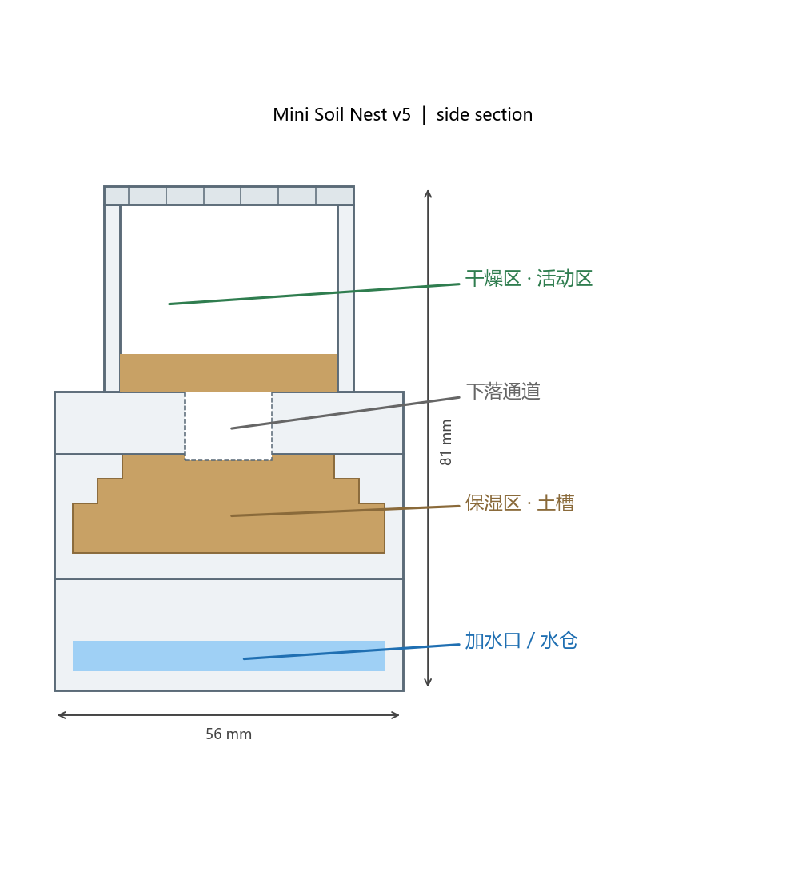
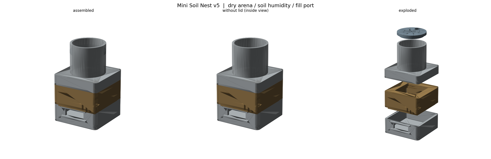

# 迷你垂直分层土巢 v5（干燥区 / 保湿区 / 加水口）

照着市面常见的"分层土巢"做的 3D 打印版：**56 × 56 mm**，总高 **81 mm**，
五个零件免支撑叠装。上部干燥活动区，中部铺土保湿区，底部水仓带推拉式加水口。





## 零件

| 文件 | 位置 | 说明 |
|------|------|------|
| `design/water_tank.stl` | 底 0–18 mm | 水仓 + 正面**推拉式加水口**（含上下导轨） |
| `design/slider.stl` | — | 加水口滑盖（带指推凸块） |
| `design/nest_tray.stl` | 18–38 mm | **保湿区**：土槽（3 级 45° 台阶，免支撑）+ 多孔底板（水汽上行）+ 底部定位唇 |
| `design/arena.stl` | 38–78 mm | **干燥区**：方形底座 + Ø40 圆形围栏 + Ø14 中央下落通道（洞口有围堰挡土） |
| `design/arena_lid.stl` | 78–81 mm | 圆形顶盖：中心 + 8 孔透气 + 一个 Ø8 喂食口 + 定位凸环 |

## 工作原理

```
        干燥区 (活动区)          ← 铺沙, 蚂蚁觅食
             │  Ø14 下落通道
        保湿区 (土槽)            ← 铺土/椰土, 蚂蚁挖巢
             │  ~80 个 Ø2 底板孔 (水汽上行)
        水仓  (加水口/滑盖)       ← 加水, 水位到加水口下沿自动停止 (~12 ml)
```

- **蚂蚁路径**：活动区 → 中央通道 → 土槽挖巢。
- **保湿路径**：水仓水分蒸发 → 穿过土槽底板孔 → 润湿土壤，均匀、可控、不会淹没巢室。
- **加水**：推开正面滑盖往水仓注水，加到水从加水口溢出即满（滑盖下沿就是水位上限）。

## 打印建议

- 材料 PLA / PETG；层高 0.16–0.2 mm；喷嘴 0.4 mm；**免支撑**，全部平放开口朝上。
- 壁数 3，填充 20–25%。土槽底板孔多，**建议 4 圈壁**更结实。
- 五个件里只有 `slider` 很小，注意别被吹飞。

## 组装与使用

1. 打印五件。`slider` 平放打印，装到水仓正面的上下导轨之间。
2. **装水仓**：推开滑盖，加水到溢流为止（约 12 ml）。想更持久可在水仓里塞一小块海绵。
3. **铺土**：把 `arena`（干燥区）拿起，往 `nest_tray` 土槽填入椰土/红土/珍珠岩混合土，填到台阶略低处（别堵住底板孔）。
4. 把 `arena` 盖回土槽上（底面 4 角定位唇自动就位），铺一层沙/土。
5. 盖上 `arena_lid`；需要防逃可在圆筒内壁上部涂一圈**防逃液/滑石粉**。
6. 食物从小喂食口或掀盖放入干燥区。
7. **补水**：水仓见底时推盖加水即可；干燥季节可缩短间隔。

> 保湿区湿度偏高的品种（如 Camponotus、Pheidole 部分）适合本结构；
> 若巢内壁结露，短暂掀盖通风或减少注水量即可。

## 参数化

```powershell
python generate_nest.py
```

可调：`S`（footprint）、`T`（壁厚）、`TANK_H`/`MOUTH_Z0`（水仓高度与水位上限）、
`SOIL_DEPTH`、`STAIR`（土槽台阶）、`GRILL_R`/`GRILL_PITCH`（底板孔）、
`CYL_OD`/`CYL_H`（活动区圆筒）、`TUNNEL_R`（下落通道）。

## 依赖

Python 3.11+，`shapely`、`trimesh`、`manifold3d`、`numpy`、`matplotlib`。

## 版本

- `v5_soil_tower/`（本目录）垂直分层土巢 —— 对应市面主流样式
- `v4_mini_compact/` 单板式 + 石膏蓄水层
- 仓库根目录 v2 / v3（OpenSCAD 塔式）
