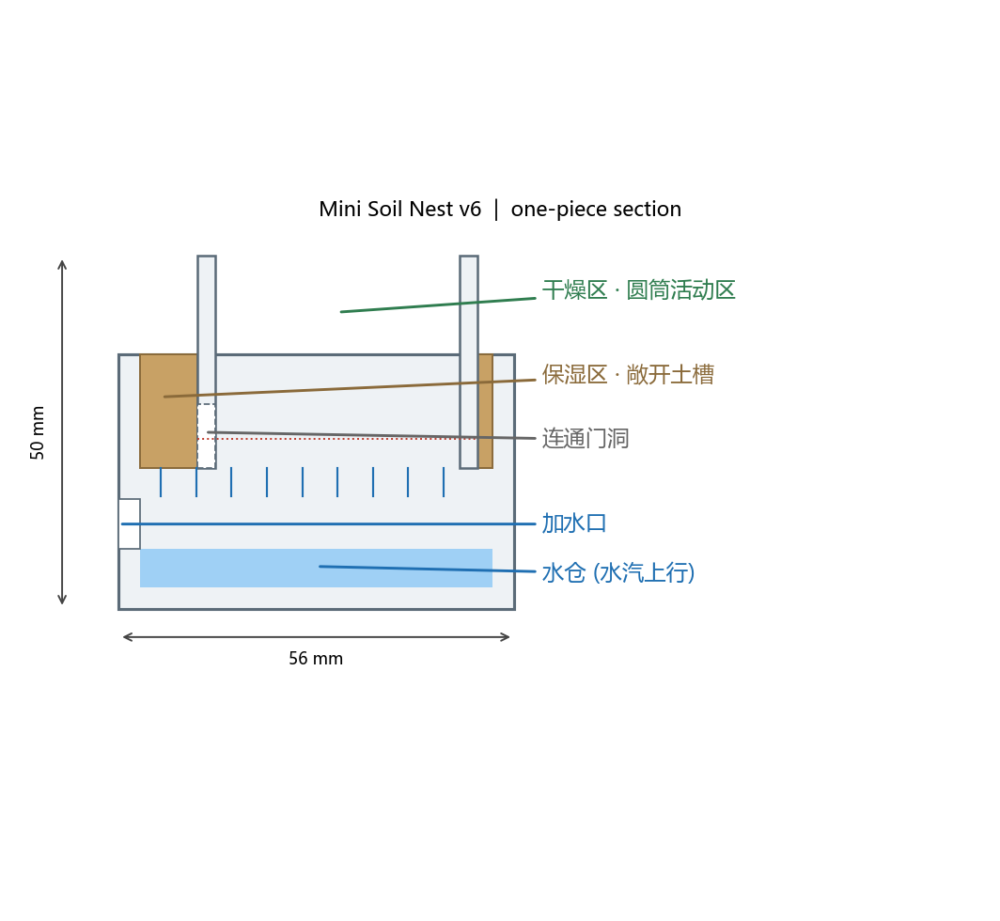
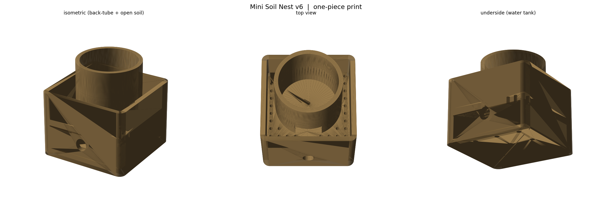

# 迷你一体式土巢 v6（单件一次打印）

**一个 STL、一次打印成型、免支撑**：56 × 56 × 50 mm。
后部圆筒是干燥活动区，前面是敞开的保湿土槽，底层水仓靠前壁加水孔补水。
对着市面分层土巢的功能分区做的"一体化"版本。





## 文件

| 文件 | 说明 |
|------|------|
| `design/nest_onepiece.stl` | **整机一体件**（无需组装） |
| `generate_nest.py` | 参数化生成脚本 |
| `preview/` | 剖面图与 3D 预览 |

## 结构（从上到下）

```
   干燥区 · Ø40 圆筒活动区        ← 后部, 圆筒内地面实心保持干燥
        │ 连通门洞 (前壁开 16×9 门)
   保湿区 · 敞开土槽 (50×50×16)   ← 前部, 铺土/椰土, 蚂蚁挖巢
        │ 土槽底板 ~70 个 Ø2 孔 (水汽上行, 圆筒下方不开孔)
   水仓 (50×50×13 ≈ 14 ml)        ← 底层, 9 根 Ø3 支撑柱
        └ 前壁加水孔 Ø7 (下沿即水位上限, 加水到溢出即满)
```

- **蚂蚁路径**：圆筒活动区 → 门洞 → 土槽挖巢。
- **保湿**：水仓蒸发 → 底板孔 → 润湿土壤。圆筒下方底板**不开孔**，所以活动区保持干燥。
- **加水**：前壁 Ø7 孔用滴管/针筒注水，加到溢出即满；水位（≈z8.5）始终低于底板（z16），**不会渗进土里**。
- 加水时腔内空气从底板孔排出，不用另开排气孔。

## 为什么"一体"也能打

- 所有空腔**开口朝上**（圆筒开口、土槽开口、水仓靠侧孔），没有倒扣。
- 水仓顶那块带孔底板是唯一的大面积悬空；内部 **9 根 Ø3 支撑柱**把 50 mm 跨度切成 ~15 mm 小格，普通 FDM 桥接即可，**不用支撑**。
- 圆柱与土槽壁都竖直，无悬空。

## 打印建议

- 材料 PLA / PETG；层高 0.16–0.2 mm；喷嘴 0.4 mm；**免支撑**。
- 壁数 3，填充 20%；**桥接速度调低、风扇全开**，让底板桥接更平整。
- 平放打印（大平面在底），打完把底面边缘轻磨平整即可。

## 使用

1. 从**敞开土槽**填入椰土/红土/珍珠岩混合土，填到比槽口低 3–5 mm（别堵住底板孔）。
2. 用滴管从前壁**加水孔**注水，加到有水溢出为止（约 14 ml）。
3. 圆筒活动区铺一层薄沙；想防逃，在圆筒内壁上沿涂一圈**防逃液/滑石粉**，或盖一片纱网/亚克力。
4. 食物放活动区；圆筒顶部敞开，方便喂食和观察。
5. **补水**：水仓快干时再注一次水即可，干燥季节缩短间隔。

> 若土槽偏湿（结露/发霉），减少注水量或改用排水性更好的土；
> 若偏干，加满水或把土换成保水性更好的椰土。

## 参数化

```powershell
python generate_nest.py
```

可调：`S` 外形、`T` 壁厚、`BODY_H`、`FILL_Z`（水位上限）、`SOIL_TOP`、`GRILL_R/PITCH`、
`CYL`（圆筒位置/直径）、`POSTS`（支撑柱）、`DOOR`（门洞尺寸）。

## 依赖

Python 3.11+，`shapely`、`trimesh`、`manifold3d`、`numpy`、`matplotlib`。

## 版本

- `v6_onepiece/`（本目录）**一体式**土巢 —— 单件一次打印
- `v5_soil_tower/` 垂直分层土巢（分件叠装 + 推拉加水口）
- `v4_mini_compact/` 单板式 + 石膏蓄水
- 仓库根目录 v2 / v3（OpenSCAD 塔式）
