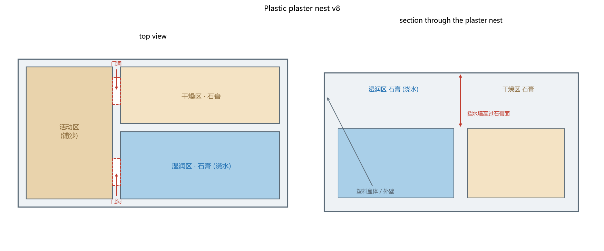
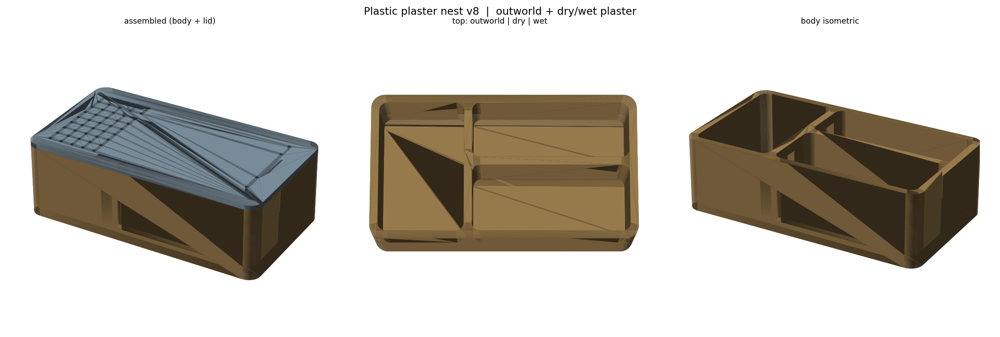

# 3D 打印塑料巢 + 石膏（干湿分区）+ 活动区 · v8

一个塑料盒体，左侧活动区，右侧石膏巢区**分成干燥区和湿润区**，中间一道塑料隔墙挡水。
石膏由用户自己倒，**保湿就是直接往湿润区石膏上浇水**——没有水仓、没有注水孔、没有微缝。





## 文件

| 文件 | 说明 |
|------|------|
| `design/nest_body.stl` | 盒体（活动区 + 干燥区 + 湿润区） |
| `design/nest_lid.stl` | 盖子（活动区透气孔 + 巢区少量微孔，防逃） |
| `generate_nest.py` | 参数化生成脚本 |

## 结构与尺寸（100 × 55 × 30 mm）

```
俯视
+------------------------------+---------------------------+
|                              |   干燥区 · 石膏            |  ← 不浇水
|      活动区 (铺沙)            |---------------------------|
|   [门洞]──────────────────────|                            |
|                              |   湿润区 · 石膏            |  ← 直接浇水
+------------------------------+---------------------------+
```

- **活动区**：左侧 32×49 mm 凹腔，铺沙；食物/垃圾区，保持干燥。
- **干燥区 / 湿润区**：右侧两块石膏，各 59×21 mm，中间 **3 mm 塑料隔墙**，墙顶高过石膏面 → 浇的水不会串到干燥区。
- **门洞**：活动区隔墙上各开一个 10×8 mm 门洞，分别通向干燥区、湿润区。
- 石膏面与沙面**同高**（离底 18 mm），蚂蚁在三个区间平走。
- 石膏厚 15 mm，够蚂蚁挖小巢室。

## 使用

1. **倒石膏**：调好石膏浆，分别倒入右侧的干燥槽和湿润槽，刮平到与活动区凹腔底同高（离底约 15 mm）。
2. **晒干/定型**：石膏完全凝固后，可用牙签/小勺在石膏面戳出几个起始孔洞，方便蚂蚁开挖。
3. **铺沙**：活动区填沙到与石膏面齐平。
4. **加湿**：往**湿润区**石膏上滴水，让它吸饱水（表面发亮、底下渗湿即可，别积水）。
5. **盖盖**：盖上盖子（活动区透气孔保持通风）。
6. **补水**：湿润区石膏干了就再浇一次，一般 3–7 天一次，看气候。

> 想要更大的湿度梯度：湿润区多浇、干燥区不浇；蚂蚁会自己在两块石膏里选择合适的位置。

## 打印

- 材料 PLA / PETG；层高 0.16–0.2 mm；喷嘴 0.4 mm；**免支撑**。
- 壁数 3，填充 20%。
- 盒体和盖子都平放打印。盖子上的透气孔 Ø1.8，正常可打。
- 想防逃，可在活动区上沿内侧涂一圈防逃液。

## 参数化

```powershell
python generate_nest.py
```

可调：整体 `SX, SY, H`；石膏面高度 `PZ`；活动区 `OW`；巢区 `NEST`；干湿隔墙 `DIV_Y`；
两个门洞位置 `DOOR_DRY / DOOR_WET`。

## 依赖

Python 3.11+，`shapely`、`trimesh`、`manifold3d`、`numpy`、`matplotlib`。
