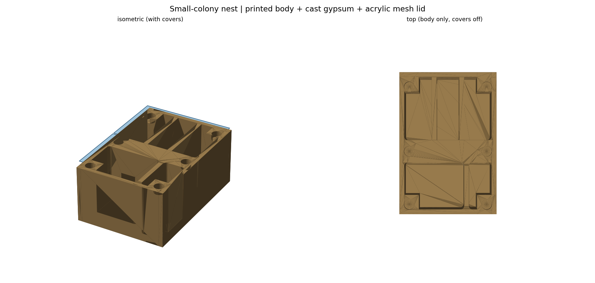
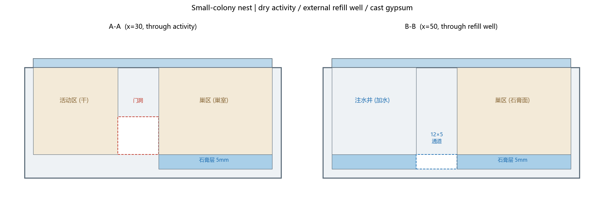

# 小群落蚁巢 · 塑料巢体 + 浇筑石膏保湿 + 亚克力网盖

按 `ant-nest-builder` skill 的 baseline 做的可打样包。**60 × 88 × 38 mm**（比 baseline 80×112 缩小约 65%，五金/网/壁厚不缩放）。





## 假设（species 未知，按保守小群处理）

| 项目 | 取值 | 说明 |
|------|------|------|
| 目标 | 小群落 / 工蚁 2–4 mm 起步 | 通道/门洞按小蚁保守值 |
| 材料 | PLA（用户指定） | ⚠️ PLA 长期接触水/清洗不如 PETG，样板阶段可用，量产建议 PETG |
| 打印机 | 0.4 mm 喷嘴 | 0.2 层高、5 壁、6 顶底、20–30% 填充 |
| 外部件 | 亚克力 / 磁铁 / M3 / 304 网 均可购 | 磁吸盖 + 网压框方案 |
| 石膏 | 无香精陶瓷模具石膏 | 5 mm 厚、连续浇筑 |

> 以上为**起点假设**，不是通用规格；通道宽、巢室高、门洞需按实际蚁种复核。

## 结构

```
前  ┌───────────────┬────────┐
    │  活动区(干)    │ 注水井 │   ← 活动区铺沙/干; 注水井 5mm 深
    ├───────────────┴────────┤
    │   隔墙 + 门洞(A)         │   ← 门洞 Z8..21 连通活动区↔巢区
    ├────────────────────────┤
    │  巢区: 3 个巢室 + 石膏层 │   ← 石膏 5mm 铺在各巢室底部
    │  (石膏面 = 活动区地面高度)│   ← 注水井经 12×5 通道渗入石膏
后  └────────────────────────┘
```

- **活动区**：独立干燥区，地面与石膏面同高，经**门洞**进巢区。
- **注水井**：独立于巢室的注水口（亚克力盖上有 Ø8 孔 + 打印塞），水经 **12×5 通道**渗入石膏；**不在巢内留静水**。
- **巢区**：3 个打印巢室，底部 5 mm 连续石膏层（用户浇筑），巢室间有门洞；巢室墙底部留连通缺口，保证石膏层连续。
- **石膏面低 5 mm**：活动区/巢区地面在 Z=8，石膏顶面也是 Z=8，蚂蚁三区平走。

## 文件

| 文件 | 用途 |
|------|------|
| `design/nest_body.stl` | 巢体（打印） |
| `design/mesh_clamp.stl` | 金属网压框（打印） |
| `design/fill_plug.stl` | 注水口塞（打印） |
| `design/acrylic_activity_cover.dxf / .svg` | 活动区盖（3 mm 亚克力，含通风窗+安装孔+注水孔+拉手） |
| `design/acrylic_nest_cover.dxf / .svg` | 巢区盖（3 mm 亚克力） |
| `bom.csv` / `BOM.md` | 物料清单 |
| `generate_nest.py` | 参数化源码（改尺寸/通道/巢室后重跑） |
| `preview/` | 装配图、剖视图 |

## 打印

- PLA，0.4 喷嘴，0.2 层高，5 壁，6 顶底，20–30% 填充，**免支撑**。
- 主体平放（大平面朝下）；**压框网面朝下平放**打印，网面必须平整。
- 主体朝向要保证石膏腔/通道内**不留封死的支撑料**。

## 组装

1. 打印巢体、压框、注水塞。
2. 亚克力按 DXF/SVG 激光切割（**先实测亚克力厚度再定孔位/磁铁深度**）。
3. **浇筑石膏**：按石膏厂家粉水比调浆，倒入巢区各巢室底部（约 5 mm 深，填到与活动区地面同高）。完全干燥后再用。
4. **装网**：把 28×18 mm 的 100 目 304 网片放在活动区盖的 20×10 通风窗内面，用压框+4×M3×10 压紧；**网片不要打孔**，螺丝走网的边缘外。
5. **磁吸**：巢体 8 个 Ø6.4 孔放 6×2 磁铁；亚克力盖对应位置用 4×M3×6 **磁性钢**螺丝+螺母（先确认能被磁铁吸住）。
6. 盖活动区盖、巢区盖，插注水塞。

## 加水 / 清洁

- **只在注水井加水**（经亚克力盖 Ø8 孔），加到 5 mm 深即可，让其吸收；**巢内不要留静水**。
- 井水被石膏吸收后，约 2–3 天看一次，井空了再补。
- 清洁：取下亚克力盖，巢区石膏表面苔/霉菌用小刷子干刷；石膏可整体取出更换（如需重浇）。
- 亚克力用清水+软布，勿用溶剂。

## 验收（放蚁前必做）

1. **干装检查**：亚克力盖放平，磁吸后边缘不翘起。
2. **反复开合检查**：多次取放盖，磁吸/网框不松、不变形。
3. **注 / 干循环检查**：多次加水-干燥，检查石膏有无空鼓、裂纹、掉粉、渗漏；确认水不进入活动区。
4. **逃逸间隙检查**：把巢放入**二级防逃盒**，至少观察 48 h，检查目标蚁种能否从网、盖缝、门洞边缘逃出。

> 本设计**不提供**"对所有蚁防逃""适合所有蚁种"之类保证；网目、缝宽、防逃液需按实际蚁种实测。

## 未验证风险（保留）

- 石膏的实际吸水/放湿曲线、干缩开裂、抗挖掘性需实物测试。
- 磁铁实际尺寸/吸力、亚克力实测厚度会影响盖的贴合；孔位与磁铁深度需按实物修正。
- 304 不锈钢网**不保证**能被磁铁吸附，仅磁吸盖的钢螺丝面用于吸合。
- 100 目网对小蚁可能仍偏大，需按蚁种复核。
- PLA 与长期潮湿环境的耐久性未验证。

## 采购

- 需先询价：材料、网目/孔径、尺寸、数量、运费、加工公差。
- 石膏类需确认：无香精、无抗菌/防霉/防水/颜料等添加剂（涉及动物接触）。
- 报价与实付分开记录；**未经授权不下单、不代付**。

## 参数化

```powershell
python generate_nest.py
```

可调：`SX, SY, H`（外形）、`ACT/WELL/DIV/NEST`（分区）、`NEST_WALLS`（巢室墙）、
`CHANNEL`（12×5 通道）、`DOOR`（门洞）、`MAG_POS/MAG_D/POCKET_D`（磁吸）、
`ACT_COVER/NEST_COVER/WINDOW/WINDOW_C/CLAMP`（亚克力与网框）。

## 依赖

Python 3.11+，`shapely`、`trimesh`、`manifold3d`、`numpy`、`matplotlib`、`ezdxf`。
